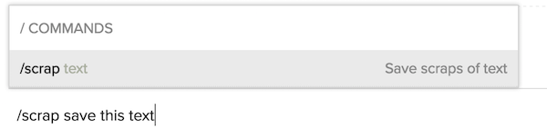
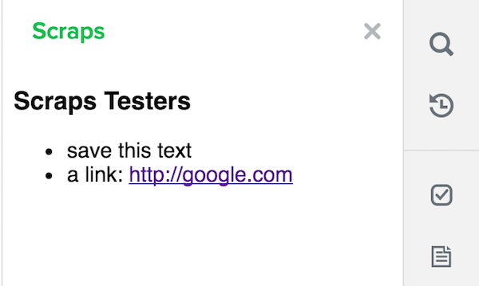

# Flock Scraps

A [Flock][] app to save scraps of text for your conversations. Built using [FlockOS][] and its [node.js sdk][].

The app installs a [slash command][] that allows users to save scraps of text,



and a [chat tab button][] that launches a sidebar [widget][] which lists all the
scraps for a conversation.



## Download and Installation

```
git clone git@github.com:chaitanyagupta/flock-scraps.git
cd flock-scraps
npm install
```

## Getting Started

You will need an HTTPS endpoint for your app that is publicly available. If the
machine on which you run the app doesn't have a public IP address, you can
either use a reverse proxy, or [ngrok][].

Take note of the public HTTPS endpoint for your app as configured in the proxy
or provided by ngrok. You will need this while configuring the app in the steps
below.

[Create your app](https://docs.flock.co/display/flockos/Creating+an+App) in the
developer dashboard. After creating the app, provide the following in the
advanced info section:

* Event listener URL -- your app will receive [events][] on this URL. Set this to
  `https://<your public endpoint>/events`.

* Slash command -- configure your slash command. Set the name of the command to
  `scrap` (or anything else to your liking -- here we assume that this is what
  you've used). Provide a description and select the action "Send to event listener".

* Chat tab button -- Provide a tooltip text, select action "Open widget", and
  desktop type to "Sidebar". Set the action URL to `https://<your public
  endpoint>/scraps`.

Save your changes. After saving them, you will be provided with your app id and
app secret (click "Show" next to the app secret to see it).

Go back to your repository root, and create a file called `config.js` with the
following info:

```js
module.exports = {
    port: 8080           // this is the default
    appId: '<app id>',
    appSecret: '<app secret>',
    endpoint: 'https://example.com'
};
```

`endpoint` is the publicly available endpoint for your app.

Now start the app:

```
node index.js
```

## How it works

The app listens for these two events on the event listener URL (`https://<your public
endpoint>/events`):

* [app.install][] -- on receiving this event, the app saves the user id and
  token in an in-memory database.

* [client.slashCommand][] -- on receiving this event, the app saves the scrap in
  an in-memory database. It also sends a message to all members of the
  conversation on behalf of the user that a new scrap has been created. To send
  the message, it needs the token received on `app.install` for each user who
  has installed the app.

A chat tab button is installed to see the list of scraps per
conversation. Clicking on it launches a sidebar with the URL `https://<your public
endpoint>/scraps`.

See [index.js](index.js) for the annotated source code.

## In-Memory Database

The app uses in memory objects to persist tokens and scraps. On exit, these objects are
serialzied into a file called `scraps.json` in the current working directory.

On startup, the app looks for the same file, and if present, the in-memory
objects are populated using this file.

See [store.js](store.js) for more details.

[flock]: https://flock.co
[flockos]: https://docs.flock.co
[node.js sdk]: https://github.com/flockchat/flockos-node-sdk
[ngrok]: https://ngrok.com
[events]: https://docs.flock.co/display/flockos/Events
[slash command]: https://docs.flock.co/display/flockos/Slash+Commands
[chat tab button]: https://docs.flock.co/display/flockos/Chat+Tab+Buttons
[widget]: https://docs.flock.co/display/flockos/Widgets
[app.install]: https://docs.flock.co/display/flockos/app.install
[client.slashCommand]: https://docs.flock.co/display/flockos/client.slashCommand
